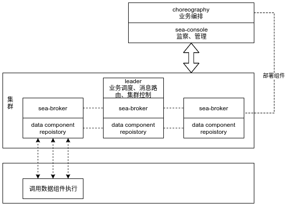

# Sea 设计

 `Sea 平台架构图`

## 集群化

- 集群成员：提供节点的容错能力
- 负载均衡：通过路由算法将任务负载分配到集群中的多个节点上并行执行

## 子系统

总体上看，Sea 平台分四大部分，2 类程序（每个程序可运行多个节点）。2 类程序为：引擎（engine）和控制台（console）。

- 引擎：其中一个做为协调者，实现调度功能。调度Job，从Job中提取Task并分配到引擎执行。接收Task，调用组件执行。
    - scheduler: 集群中的一个单例节点，Sea 将在集群中自动选择一个节点做为
    - engine
- 控制台：基于Web的图形化监查、管理控制程序。可监控 Sea 运行状态，控制系统功能，编辑、配置、部署业务编排文件。
    - console
    - choreography

Sea 在生产运行时只需要启动 engine 集群即可，console 作为管理控制台可选运行。

## 数据通信

**消息、通信** Sea 基于 Akka Cluster 完善而强大的集群支持，不需要再使用一个单独的 **数据总线** 系统来做服务发现、注册，
进程间消息通信等功能。

**监控上报** 引擎的各种运行状态可通过 Akka 的分布式发布、订阅功能进行实时上报，console 可选消费相关主题分组的消息。

**组件与集群通信**，组件与集群单通信主要有两种方式，1：通过 Akka Cluster Client 连接到集群，2：写入规定路径的日志。*（
以 sea-ipc 的通信协议规范发送消息）*

1. 使用Akka Cluster Client 连接集群：当引擎启动外部组件时，组件不并不在集群环境内运行。这时，当组件需要与 Sea 通信时，
   如组件应直接将消息上报给当前运行节点的引擎。
2. 以规定格式写入日志文件，引擎将解析日志文件并上报。

## 仿真、开发、调试

在实际工作中我们需要在开发或测试环境模拟线上数据及运行状态，提前编排好业务规则，同时在上线生产环境前预跑流程并提前查找到
问题及错误。基于本身 Sea 的灵活性和部署简易性，我们可在任务环境（Linux服务器）下方便、快速的搭建出一套于生产环境类似的仿
真环境。
